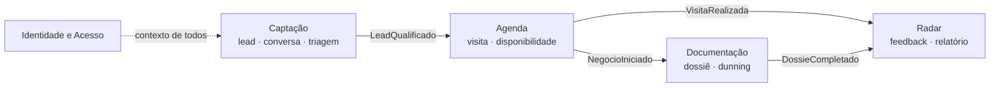
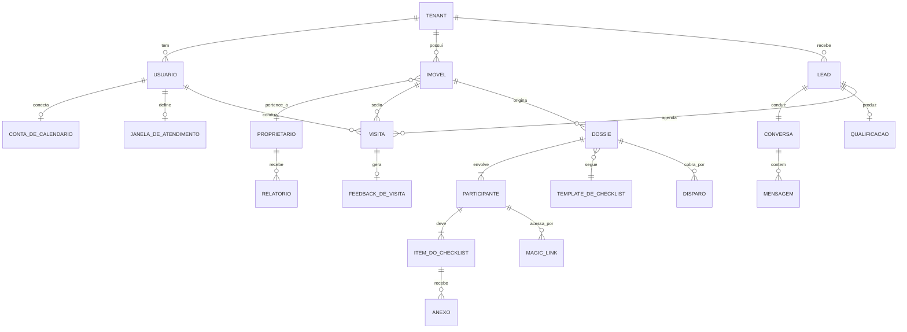
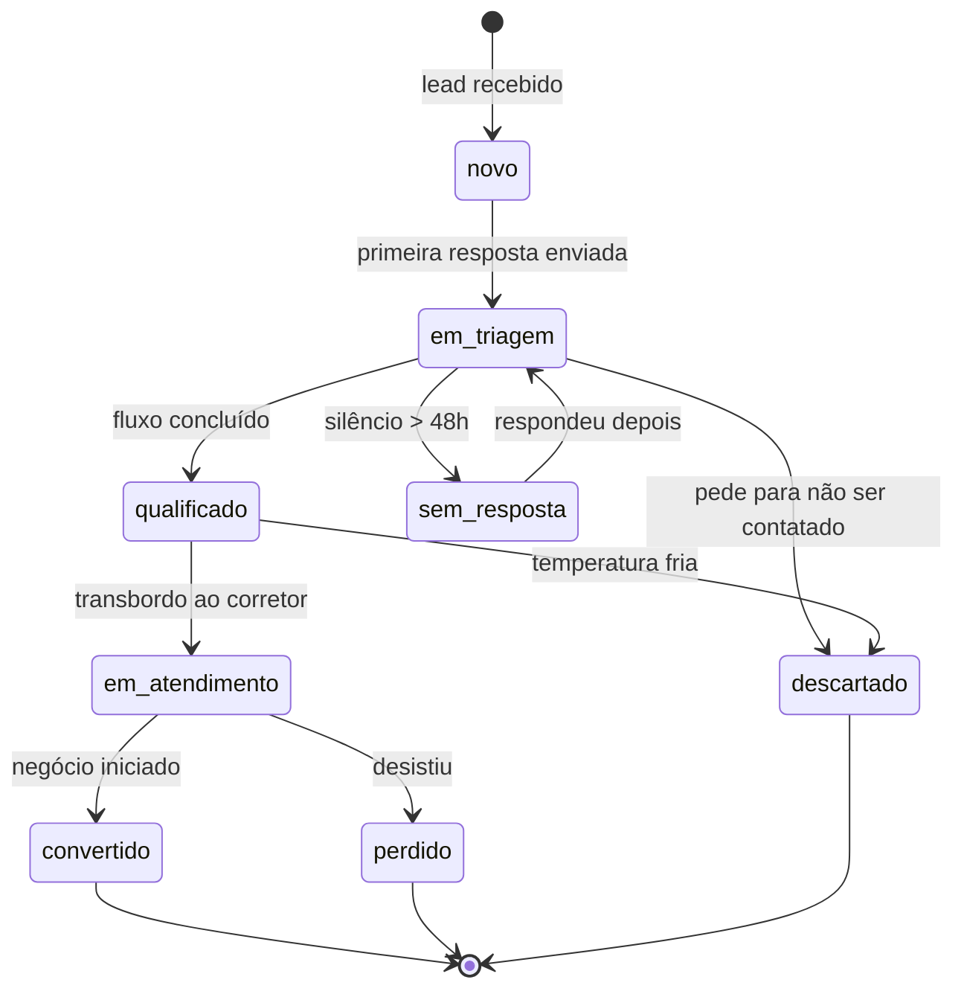
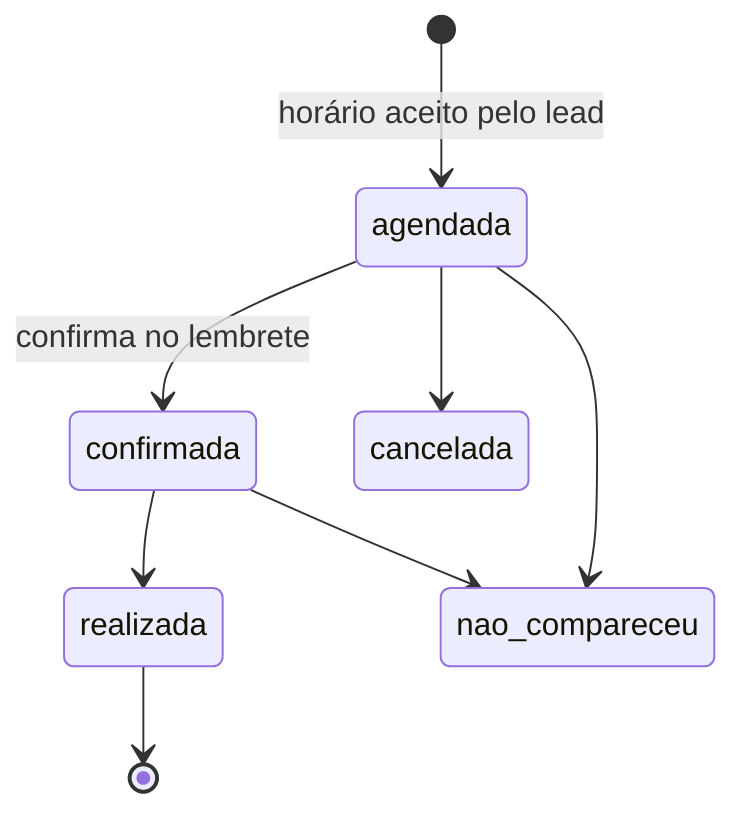
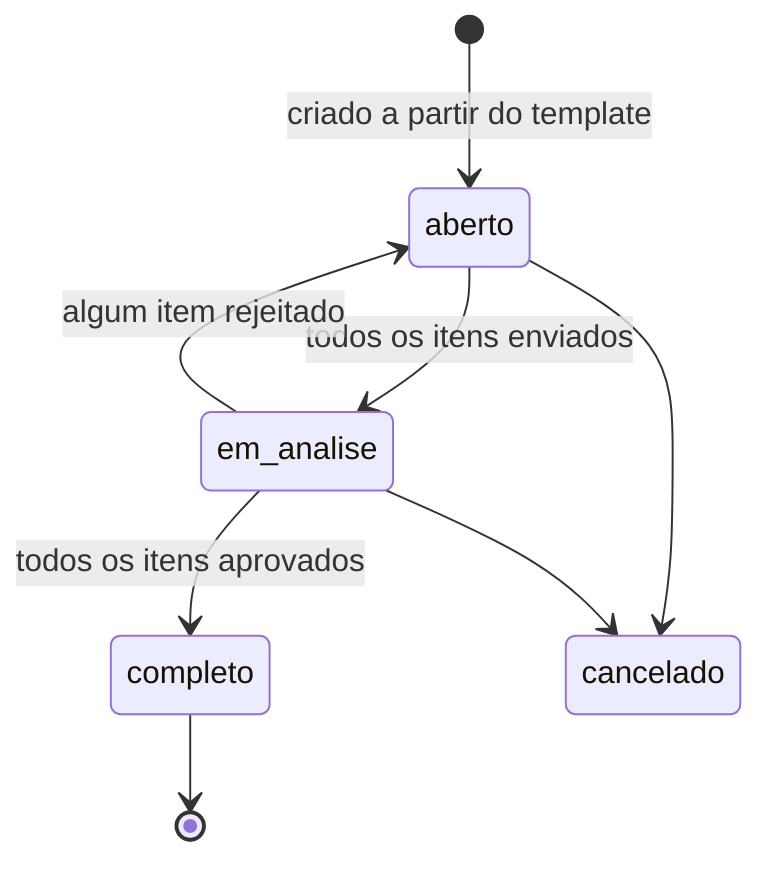
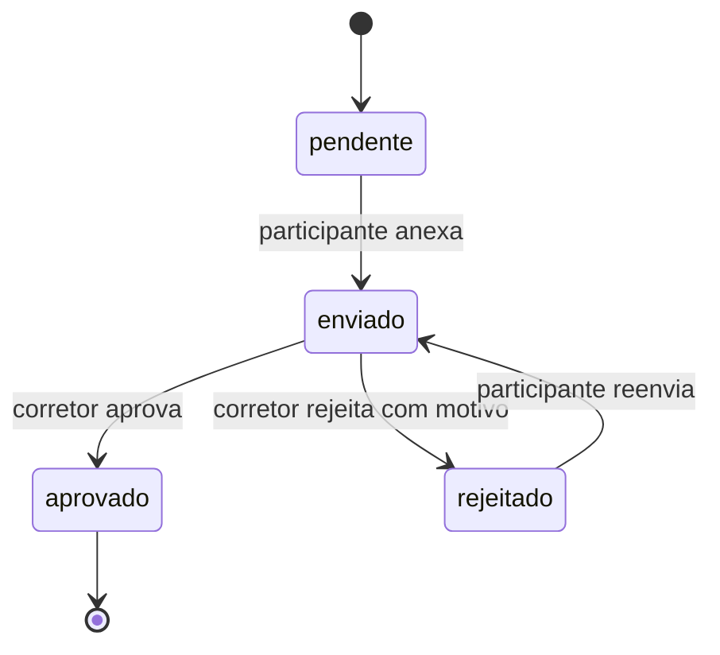

# Modelo de domínio

Vocabulário em [glossario.md](glossario.md). Este documento descreve **as
entidades, seus limites e suas máquinas de estado** — sem comprometer com
nenhuma tecnologia (a stack está em aberto, [ADR-0002](../adrs/0002-escolha-de-stack.md)).

## Contextos delimitados

O sistema tem quatro contextos com razões de mudança diferentes. Eles se
comunicam por **eventos de domínio**, não por chamada direta a repositório
alheio — é o que permite construir e substituir um sem quebrar os outros.

| Contexto | Uma razão para mudar | Entidades |
| --- | --- | --- |
| **Identidade e Acesso** | Regras de quem entra e o que pode | Tenant, Conta, Usuário, Papel |
| **Captação** | Regras de qualificação e canal de mensagem | Lead, Conversa, Mensagem, Qualificação |
| **Agenda** | Regras de disponibilidade e calendário | Visita, JanelaDeAtendimento, ContaDeCalendario |
| **Documentação** | Regras de checklist e cobrança | Dossiê, Participante, ItemDoChecklist, Anexo, MagicLink, Disparo |
| **Radar** | Regras de relatório ao proprietário | FeedbackDeVisita, RelatorioDoProprietario |

**Imóvel** e **Proprietário** são compartilhados: vivem num núcleo comum
referenciado por todos, com um único dono de escrita (Captação/cadastro).

## Invariantes globais

Regras que valem em todo lugar. Violá-las é bug de severidade máxima:

1. **Toda entidade pertence a exatamente um tenant.** Não existe linha órfã e
   não existe consulta sem filtro de tenant. Garantido na camada de dados —
   ver [multi-tenancy](../fundacao/multi-tenancy.md).
2. **Nenhuma referência cruza tenant.** Um dossiê nunca aponta para imóvel de
   outro tenant.
3. **Temperatura é derivada, nunca digitada.** Recalcular a partir da
   qualificação deve dar sempre o mesmo resultado.
4. **Anexo é imutável.** Correção é anexo novo; o anterior é arquivado, não
   sobrescrito — a trilha de auditoria depende disso.
5. **Toda transição de estado é registrada** com quem, quando e por quê.
6. **Todo efeito externo é idempotente** por chave de negócio. Reprocessar um
   job nunca envia mensagem duplicada.

## Entidades e relações

## Máquinas de estado

As transições abaixo são o contrato do domínio. Qualquer transição não
desenhada aqui é inválida e deve falhar com erro explícito, informando o
estado atual e os destinos permitidos.

### Lead

- `descartado` por pedido do próprio lead é **terminal e definitivo**: nenhum
  disparo automático posterior, em nenhum módulo. Exigência de LGPD e da
  qualidade do número (R2 do [PRD](../prd.md)).
- `qualificado → em_atendimento` só depois do transbordo; enquanto o bot
  conduz, o corretor não recebe notificação — esse é o ponto do produto.

### Visita

`realizada` e `nao_compareceu` alimentam o Radar; a segunda é métrica de
qualidade da triagem, não só estatística.

### Dossiê

O dossiê **não** tem estado próprio digitável: é sempre derivado da situação
dos itens de todos os participantes. Isso mantém uma única fonte de verdade e
elimina a classe de bug "dossiê completo com item pendente".

### Item do checklist

Rejeitar **exige** motivo não vazio: sem ele o participante repete o erro e o
ciclo se arrasta — exatamente a dor que o módulo existe para resolver.

## Eventos de domínio

Nomeados no pretérito, carregam id e tenant, publicados após a transação
persistir:

| Evento | Publicado por | Consumido por |
| --- | --- | --- |
| `LeadRecebido` | Captação | Triagem (dispara boas-vindas) |
| `LeadQualificado` | Captação | Agenda (oferece horários), Painel |
| `LeadDescartadoPorSolicitacao` | Captação | Todos (silencia disparos) |
| `VisitaAgendada` | Agenda | Lembretes |
| `VisitaRealizada` | Agenda | Radar (pede feedback) |
| `NegocioIniciado` | Agenda / Painel | Documentação (abre dossiê) |
| `ItemRejeitado` | Documentação | Dunning (reinicia cadência) |
| `DossieCompletado` | Documentação | Dunning (encerra), Painel |
| `FeedbackRegistrado` | Radar | Relatório |

## Decisões de modelagem

| Decisão | Motivo |
| --- | --- |
| Lead e Usuário são entidades separadas | Lead nunca autentica no painel; unir os dois convida a vazamento de permissão |
| Participante tem checklist próprio, não o dossiê | Fiador e locatário mandam coisas diferentes e não podem ver os documentos um do outro |
| Magic Link é entidade, não campo | Precisa de emissão múltipla, expiração, revogação e auditoria de uso |
| Anexo separado de Item | Um documento pode exigir várias páginas ou meses de extrato |
| Temperatura calculada, não armazenada como verdade | Mudou a regra, recalcula o histórico e a métrica continua comparável |
| Situação do dossiê derivada dos itens | Elimina divergência entre agregado e partes |
