# Roadmap

> **Última revisão:** 2026-07-20
> Detalhamento das estórias em [backlog/](backlog/README.md) · o porquê em [prd.md](prd.md)

Este documento responde **em que ordem** e **por quê nessa ordem**. Não contém
datas de calendário: a stack está em aberto ([ADR-0002](adrs/0002-escolha-de-stack.md))
e estimar prazo antes disso seria ficção. As durações abaixo são ordens de
grandeza para uma pessoa em tempo integral, a revisar quando a stack fechar.

---

## Princípio de sequenciamento

Ordem por **impacto financeiro e independência**, não por camada arquitetural.
Cada fase termina em algo que um cliente consegue usar de verdade.

O módulo documental vem primeiro por três razões:

1. É o mais **isolado** — não depende de conta WhatsApp aprovada nem de OAuth
   verificado pelo Google, cujos prazos não controlamos (D1–D3 do PRD).
2. Resolve uma dor **imediata e óbvia**, vendável sozinho como "Gestor de
   Fechamento".
3. Exercita toda a fundação — multi-tenancy, jobs, storage, acesso público
   seguro — no contexto mais simples possível.

As dependências externas lentas (WhatsApp Business, OAuth Google) devem ser
**iniciadas na Fase 0**, em paralelo ao código, porque a burocracia delas roda
sem nós.

---

## MVP

Objetivo: **5 a 10 clientes pagantes** (N1 do PRD). Vendido como "Ferramenta de
Fechamento e Agendamento para WhatsApp".

```mermaid
gantt
    dateFormat X
    axisFormat %s
    section Fundação
    Fase 0 — Fundação             :f0, 0, 2
    section Vendável sozinho
    Fase 1 — Dossiê + Dunning     :f1, after f0, 3
    section Topo do funil
    Fase 2 — Triagem WhatsApp     :f2, after f1, 3
    Fase 3 — Agenda               :f3, after f2, 2
    section Retenção
    Fase 4 — Radar                :f4, after f3, 1
```

### Fase 0 — Fundação (~2 semanas)

**Entrega:** nada de negócio. Base sobre a qual tudo o mais é seguro.

- Decidir a stack via spike ([ADR-0002](adrs/0002-escolha-de-stack.md)).
- Esqueleto executável, CI, migrações, ambiente local reprodutível.
- Tenant, Usuário, autenticação e autorização
  ([E1](backlog/e1-core-saas.md), passos em [fundacao/](fundacao/README.md)).
- Fila de jobs, agendador, log JSON estruturado.
- **Em paralelo, fora do código:** abrir conta WhatsApp Business e iniciar
  verificação do número (D1); criar projeto Google Cloud e submeter OAuth (D3);
  recrutar 3–5 corretores para teste (D7).

**Critério de saída:** dois tenants coexistem e um teste automatizado prova que
nenhum enxerga o dado do outro — em HTTP e em job.

### Fase 1 — Dossiê Digital + Dunning (~3 semanas)

**Entrega:** o primeiro produto vendável. Um corretor consegue abrir um dossiê,
mandar o link e receber os documentos sem cobrar ninguém à mão.

- [E5](backlog/e5-dossie-digital.md): dossiê, templates locação/venda padrão,
  Magic Link, upload mobile, painel de aprovação/rejeição com motivo.
- [E6](backlog/e6-dunning.md): rotina diária, lembrete a cada 48h, teto de
  disparos, parada automática.
- [E2](backlog/e2-ingestao.md) parcial: cadastro manual de imóvel.
- [E8](backlog/e8-analytics.md) parcial: lista operacional de dossiês.

**Nota de canal:** se o WhatsApp ainda não estiver aprovado, o dunning desta
fase sai por e-mail e o corretor envia o link manualmente. O módulo não fica
bloqueado por dependência externa — é exatamente por isso que ele vem primeiro.

**Critério de saída:** um corretor real completa um dossiê de ponta a ponta sem
enviar nenhuma mensagem manual de cobrança.

### Fase 2 — Triagem WhatsApp (~3 semanas)

**Entrega:** o lead deixa de esperar. Depende de D1 e D2 aprovados.

- [E3](backlog/e3-triagem-whatsapp.md): conexão do número, recepção via webhook
  idempotente, boas-vindas em < 60s, árvore de 3 perguntas
  ([ADR-0006](adrs/0006-triagem-por-arvore-de-decisao.md)), classificação de
  temperatura, transbordo.
- [E2](backlog/e2-ingestao.md): link parametrizado e webhook genérico.

**Critério de saída:** p95 do tempo de primeira resposta < 60s em tráfego real.

### Fase 3 — Agenda (~2 semanas)

**Entrega:** o bot fecha o agendamento sozinho. Depende de D3.

- [E4](backlog/e4-agenda.md): OAuth Google Calendar, janela de atendimento,
  cálculo de horários livres, oferta dos 3 próximos ao lead quente, criação do
  evento, lembrete 2h antes.

**Critério de saída:** uma visita agendada de ponta a ponta sem toque humano.

### Fase 4 — Radar básico (~1 semana)

**Entrega:** o argumento de retenção para fechar com imobiliária.

- [E7](backlog/e7-radar-proprietario.md): registro rápido de feedback e geração
  de relatório em texto pronto para envio.

**Critério de saída:** um proprietário recebe relatório com dados reais de
visita.

### Fora do MVP — e por quê

| Adiado | Por quê |
| --- | --- |
| Gateway de pagamento (RF1.4) | Com 10 clientes, Pix e link manual resolvem. Gateway não valida hipótese nenhuma |
| White-label (RF1.5) | Cosmético. Vira argumento de venda só na imobiliária, não no autônomo |
| Conectores por portal, XML (RF2.4–2.6) | Cada portal é um projeto próprio; webhook genérico cobre o começo |
| Roteamento entre corretores (RF2.5) | O MVP mira o corretor autônomo — não há entre quem rotear |
| LLM na triagem (RF3.7) | [ADR-0006](adrs/0006-triagem-por-arvore-de-decisao.md) |
| Reagendamento pelo lead, Outlook, buffer de deslocamento (RF4.5–4.6) | Complexidade alta, valor incremental sobre agendar |
| ZIP/PDF consolidado, OCR (RF5.6–5.7) | Corretor baixa item por item no começo; OCR é projeto à parte |
| Áudio no feedback, disparo quinzenal automático (RF7.3–7.5) | Copiar e colar valida a hipótese do Radar com um décimo do custo |
| Kanban e dashboard de conversão (RF8.2–8.3) | Métrica é dor de gestor; o MVP é do operador |

---

## Escopo geral (pós-MVP)

Sem sequência fixa: a ordem sai do que os primeiros clientes pagantes pedirem.
As fases abaixo agrupam por **tese**, não por cronograma.

### Fase 5 — Sustentar a operação comercial

Transformar validação em negócio que roda sem o fundador na cobrança.

- Assinatura recorrente, upgrade de plano, bloqueio por inadimplência (RF1.4).
- Papéis `gestor` e `secretaria`; convite e gestão de equipe (RF1.3 completo).
- White-label (RF1.5).
- Camada 3 da [autorizacao](fundacao/autorizacao.md): corretor vê só o seu.

**Gatilho:** cobrança manual virar trabalho, ou a primeira imobiliária com
equipe fechar contrato.

### Fase 6 — Escalar a captação

- Conectores nomeados por portal e Meta Ads (RF2.4).
- Roteamento round-robin e por perfil (RF2.5).
- Importação de imóvel por XML/link (RF2.6).
- Fluxo conversacional configurável pelo tenant (RF3.6).

**Gatilho:** clientes reclamando de cadastrar lead ou imóvel à mão.

### Fase 7 — Aprofundar a automação

- Triagem híbrida com LLM interpretando texto livre (RF3.7) — só com a
  evidência descrita no [ADR-0006](adrs/0006-triagem-por-arvore-de-decisao.md).
- Reagendamento e cancelamento pelo lead com sincronização bidirecional (RF4.5).
- Buffer de deslocamento e Outlook (RF4.6).
- Exportação consolidada do dossiê (RF5.6) e templates customizáveis (RF5.7).
- Alerta de estagnação e cadência configurável (RF6.4–6.5).

**Gatilho:** dados de uso mostrando onde a rigidez trava o fluxo.

### Fase 8 — Radar completo e inteligência

- Feedback por áudio com transcrição (RF7.3).
- Disparo quinzenal automático ao proprietário (RF7.4).
- Agregação de métricas de visualização dos portais (RF7.5).
- Funil kanban (RF8.2) e dashboard de conversão por corretor (RF8.3).

**Gatilho:** venda para imobiliária, onde o dono compra visibilidade.

---

## Riscos que podem reordenar tudo

| Risco | Impacto | Reação |
| --- | --- | --- |
| Verificação do WhatsApp demora ou é negada | Fases 2 e 4 param | Fase 1 já é vendável sozinha; dunning por e-mail sustenta enquanto isso |
| OAuth Google não aprovado a tempo | Fase 3 para | Agendamento manual assistido como paliativo |
| P1 falsa (lead não fala com bot) | Tese do topo do funil cai | Reposicionar para o módulo documental, que não depende de P1 |
| P2 falsa (cliente não usa Magic Link) | Fase 1 perde valor | Reordenar: subir triagem e agenda para primeiro |
| Número bloqueado por excesso de disparo | Canal morre | Cadência conservadora desde o início; monitorar rating como incidente |
| Stack escolhida errada | Retrabalho de fundação | Spike da Fase 0 existe exatamente para isso |

## Histórico

| Data | Mudança |
| --- | --- |
| 2026-07-20 | Roadmap criado. Ordem definida por impacto financeiro e independência de dependências externas lentas |
